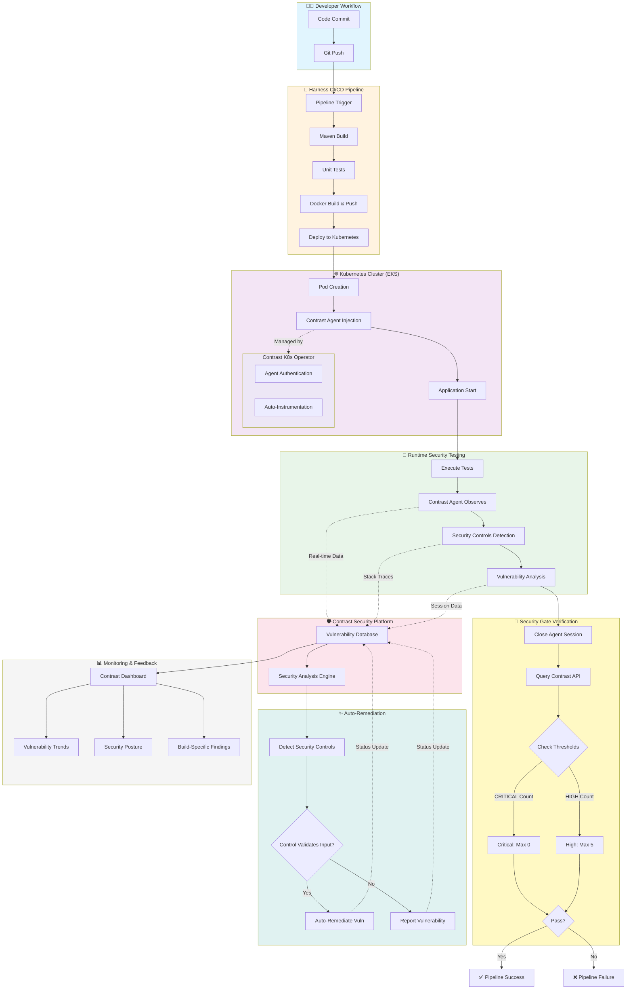

# 🔓 Vulnerable Demo Application for IAST Testing


## ⚠️ WARNING - INTENTIONALLY VULNERABLE APPLICATION

**DO NOT DEPLOY TO PRODUCTION OR PUBLIC NETWORKS!**

This application contains **deliberately vulnerable code** designed for testing Interactive Application Security Testing (IAST) tools. It demonstrates exploitable implementations of the OWASP Top 10 vulnerabilities.

### 🎯 Purpose

- Test IAST tools and security scanners
- Security training and education
- Demonstrate common web application vulnerabilities
- CI/CD pipeline testing with Harness

## 🏗️ Architecture

- **Language**: Java 17
- **Framework**: Spring Boot 3.2.1 with embedded Tomcat
- **Build Tool**: Maven
- **Packaging**: Fat JAR
- **Database**: H2 (in-memory)
- **Containerization**: Docker
- **Orchestration**: Kubernetes (EKS)
- **CI/CD**: Harness

## � System Architecture & Process Flow



### 🔗 Key Integration Points

1. **Contrast Agent Injection** (Kubernetes)
   - Contrast K8s Operator automatically injects agent into pods
   - Agent credentials managed via Helm (outside this repo)
   - Application config (name, tags, metadata) via Kustomize patches

2. **Session Tracking** (Runtime)
   - Dynamic session metadata: `branchName=<branch>,buildNumber=<build>`
   - Enables per-build vulnerability tracking
   - Facilitates trend analysis across branches

3. **Security Controls Integration** (Application)
   - Custom validators: `SecurityControls.isSafeSqlInput()`, `isSafeCommandInput()`, `isSafeLdapInput()`
   - Contrast observes controls in stack traces
   - Triggers auto-remediation when controls properly validate inputs

4. **Security Gate** (Pipeline)
   - Two independent API calls: CRITICAL and HIGH severities
   - Separate thresholds: CRITICAL (max: 0), HIGH (max: 5)
   - Pipeline fails if EITHER threshold exceeded
   - Uses API credentials (NOT agent credentials)

5. **Auto-Remediation** (Contrast Platform)
   - Analyzes stack traces after session close
   - Identifies security control methods
   - Auto-remediates vulnerabilities with proper input validation
   - Example: CMDi with `isSafeCommandInput()` → Remediated

### 📊 Data Flow

```
Code → Build → Deploy → Instrument → Test → Analyze → Gate → Report
         ↓                    ↓          ↓        ↓       ↓      ↓
      Docker            Contrast    Security  Vuln DB  Pass/  Dashboard
      Image              Agent      Controls           Fail
```

### 🎯 Deployment Environments

- **Local Development**: Manual agent configuration via `.contrast/contrast.yaml`
- **Kubernetes/Harness**: Automated agent injection via Contrast K8s Operator
- **Both**: Share org-wide credentials (Org ID, API Host, API Key)
- **Distinct**: Per-user service keys and agent tokens

## �🐛 Implemented Vulnerabilities (OWASP Top 10)

### A01:2021 - Broken Access Control
- ✅ Insecure Direct Object Reference (IDOR)
- ✅ Missing Function Level Access Control
- ✅ Horizontal Privilege Escalation
- ✅ Path Traversal

### A02:2021 - Cryptographic Failures
- ✅ Weak Hashing Algorithms (MD5)
- ✅ Hardcoded Credentials
- ✅ Sensitive Data Exposure
- ✅ Insecure Random Number Generation

### A03:2021 - Injection
- ✅ SQL Injection
- ✅ Command Injection
- ✅ LDAP Injection
- ✅ Cross-Site Scripting (XSS)

### A05:2021 - Security Misconfiguration
- ✅ Verbose Error Messages
- ✅ Directory Listing
- ✅ Default Credentials
- ✅ Debug Mode Enabled

### A07:2021 - Identification and Authentication Failures
- ✅ No Rate Limiting
- ✅ Weak Password Policy
- ✅ Session Fixation
- ✅ Username Enumeration

### A08:2021 - Software and Data Integrity Failures
- ✅ Insecure Deserialization
- ✅ Unsafe JSON Deserialization
- ✅ No Integrity Checks

### A09:2021 - Security Logging and Monitoring Failures
- ✅ Log Injection
- ✅ Insufficient Logging
- ✅ Sensitive Data in Logs

### A10:2021 - Server-Side Request Forgery (SSRF)
- ✅ Unvalidated URL Fetching
- ✅ XXE (XML External Entity)
- ✅ Internal Network Scanning

## 🚀 Quick Start

### Local Development

```bash
# Build the application
mvn clean package

# Run locally
java -jar target/vulnerable-app-1.0.0.jar

# Access the application
open http://localhost:8080
```

### Docker

```bash
# Build Docker image
docker build -t vulnerable-app:latest .

# Run container
docker run -p 8080:8080 vulnerable-app:latest

# Or use docker-compose
docker-compose up
```

### Kubernetes Deployment

```bash
# Apply Kubernetes manifests
kubectl apply -f k8s/configmap.yaml
kubectl apply -f k8s/deployment.yaml

# Check deployment status
kubectl get pods -l app=vulnerable-app
kubectl get svc vulnerable-app-service
```

## 🔄 Harness CI/CD Pipeline

### Prerequisites

1. **Harness Account** with appropriate project and organization
2. **Docker Registry** credentials configured
3. **AWS EKS Cluster** provisioned
4. **Git Repository** connector configured

### Pipeline Setup

1. Update `.harness/pipeline.yaml` with your credentials:
   - `<YOUR_PROJECT_ID>`
   - `<YOUR_ORG_ID>`
   - `<YOUR_DOCKER_CONNECTOR>`
   - `<YOUR_DOCKER_REPO>`
   - `<YOUR_GIT_CONNECTOR>`

2. Update `k8s/deployment.yaml` with your Docker repository

3. Import pipeline to Harness:
   - Go to Harness UI → Pipelines
   - Click "Create Pipeline" → "Import From Git"
   - Select your repository and `.harness/pipeline.yaml`

### Pipeline Stages

1. **Build and Test**
   - Maven build
   - Unit tests
   - Docker image build and push

2. **Deploy to EKS**
   - Rolling deployment to Kubernetes
   - Health checks and verification
   - Automatic rollback on failure

## 📋 Vulnerability Testing Examples

### SQL Injection
```bash
curl -X POST http://localhost:8080/injection/sql \
  -d "username=' OR '1'='1&password=' OR '1'='1"
```

### Command Injection
```bash
curl -X POST http://localhost:8080/injection/command \
  -d "host=localhost; ls -la"
```

### XSS (Reflected)
```bash
curl "http://localhost:8080/xss/search?query=<script>alert('XSS')</script>"
```

### IDOR
```bash
curl http://localhost:8080/access-control/profile/1
curl http://localhost:8080/access-control/profile/2
```

### SSRF
```bash
curl -X POST http://localhost:8080/ssrf/fetch-url \
  -d "url=http://localhost:8080/actuator/health"
```

## 🔧 Configuration

### Application Properties

Located at `src/main/resources/application.properties`:
- Server port: `8080`
- H2 Console: `/h2-console` (enabled)
- Actuator endpoints: All exposed (insecure)

### Environment Variables

- `SPRING_PROFILES_ACTIVE`: Active Spring profile
- `JAVA_OPTS`: JVM options

## 📁 Project Structure

```
contrast-harness-pipeline-demo/
├── .harness/
│   └── pipeline.yaml              # Harness pipeline definition
├── k8s/
│   ├── deployment.yaml            # Kubernetes deployment
│   └── configmap.yaml             # Configuration map
├── src/
│   ├── main/
│   │   ├── java/com/contrast/demo/
│   │   │   ├── VulnerableApplication.java
│   │   │   ├── controller/        # Vulnerability controllers
│   │   │   ├── model/             # Data models
│   │   │   ├── repository/        # JPA repositories
│   │   │   └── config/            # Configuration classes
│   │   └── resources/
│   │       ├── templates/         # Thymeleaf templates
│   │       ├── static/css/        # CSS styles
│   │       └── application.properties
├── Dockerfile                     # Docker image definition
├── docker-compose.yml             # Docker Compose config
├── pom.xml                        # Maven dependencies
└── README.md                      # This file
```

## 🛡️ Security Recommendations

**For Production Applications** (what NOT to do based on this app):

1. ✅ Use parameterized queries (PreparedStatement)
2. ✅ Implement proper input validation and sanitization
3. ✅ Use strong password hashing (bcrypt, Argon2)
4. ✅ Enable CSRF protection
5. ✅ Implement proper access control
6. ✅ Use secure random number generators
7. ✅ Validate and sanitize all user inputs
8. ✅ Implement rate limiting
9. ✅ Use security headers (CSP, X-Frame-Options)
10. ✅ Keep dependencies updated
11. ✅ Disable verbose error messages in production
12. ✅ Implement proper logging without sensitive data

## 📚 Documentation

Comprehensive documentation is available in the [docs](./docs) folder:

- **[Harness Pipeline Guide](./docs/harness-pipeline.md)** - Complete CI/CD pipeline setup with security gates
- **[Security Controls Guide](./docs/security-controls.md)** - Custom validators/sanitizers for Contrast IAST
- **[Contrast Setup](./docs/contrast-setup.md)** - Contrast Security configuration
- **[Testing Guide](./docs/testing.md)** - Automated vulnerability test suite
- **[Vulnerability Findings](./docs/vulnerability-findings.md)** - Expected vulnerabilities and classifications

## 🤝 Contributing

This is a demo application for testing purposes. If you find additional vulnerabilities to demonstrate or improvements:

1. Fork the repository
2. Create a feature branch
3. Submit a pull request

## 📝 License

This project is licensed under the MIT License - see the LICENSE file for details.

## ⚠️ Disclaimer

This application is **intentionally vulnerable** and should **NEVER** be deployed in production or on publicly accessible networks. It is designed solely for:

- Security testing in isolated environments
- Educational purposes
- Testing IAST tools and security scanners

The authors are not responsible for any misuse of this application.

## 🔗 Resources

- [OWASP Top 10](https://owasp.org/www-project-top-ten/)
- [Contrast Security](https://www.contrastsecurity.com/)
- [Harness Documentation](https://docs.harness.io/)
- [Spring Boot Security](https://spring.io/projects/spring-security)

---

**Remember**: Use responsibly and only in isolated testing environments! 🔒

